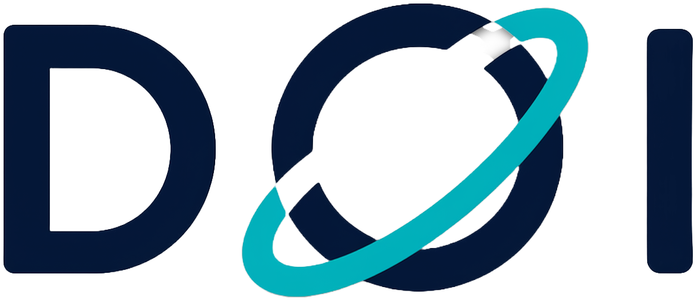
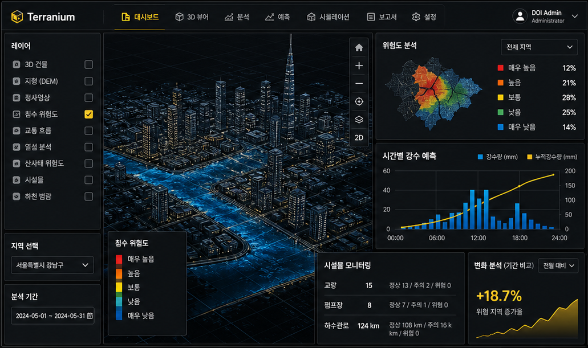

<div align="center">



# Terranium

**Spatial AI · Digital Twin Platform**

드론 측량 데이터, 2D/3D 디지털 트윈, GeoAI 분석, 검수 워크플로우,
보고서 자동화를 **하나의 안전 점검 운영 흐름**으로 연결합니다.

<p>
  
  
  
  
</p>

<a href="https://doi-kr.com"><b>doi-kr.com</b></a> · <a href="mailto:support@doi-kr.com">support@doi-kr.com</a>

</div>

---

## 🚀 Terranium이 푸는 문제

산업·공공 시설 현장에서는 **드론 영상, 점군, 도면, 검수 보고서**가 각자 다른 도구·다른 폴더·다른 클라우드에 분산되어 있습니다.
의사결정자는 흩어진 데이터를 모아 비교·검토하는 데 시간을 쓰고, 정작 *이 시설은 안전한가* 라는 질문엔 답이 늦어집니다.

Terranium은 이 흐름을 하나로 묶습니다.

<table>
  <tr>
    <td align="center" width="20%">
      <br/>
      <b>01 · 드론 매핑</b><br/>
      <sub>정사영상·LiDAR·Point Cloud·DEM/DSM·현장 사진 통합 등록</sub>
    </td>
    <td align="center" width="20%">
      <br/>
      <b>02 · 2D/3D 디지털 트윈</b><br/>
      <sub>MapLibre·Cesium 기반 Web GIS, 3D Tiles, 레이어 피쳐</sub>
    </td>
    <td align="center" width="20%">
      <br/>
      <b>03 · GeoAI 검수</b><br/>
      <sub>균열·도로 손상 모델 결과를 지도 레이어/테이블로 제공</sub>
    </td>
    <td align="center" width="20%">
      <br/>
      <b>04 · 검수 & 승인</b><br/>
      <sub>신뢰도·오탐/누락 관리, 검수 의견 기반 승인 결과 생성</sub>
    </td>
    <td align="center" width="20%">
      <br/>
      <b>05 · 보고서 자동화</b><br/>
      <sub>승인된 결과·지도 캡처·속성으로 보고서 초안 자동 생성</sub>
    </td>
  </tr>
</table>

---

## 🛰️ Why Terranium

| | |
|---|---|
| **검수 가능한 자산화** | 산개된 드론·공간 데이터를 의사결정자가 검토할 수 있는 단일 자산으로 등록 |
| **GSD 3–5cm 정밀 측량** | 일반 항공측량 대비 6–10배 정밀, 자체 운영 드론·센서로 표준 4단계 워크플로우 운영 |
| **민감 데이터 주권** | NVIDIA DGX H100 자체 데이터센터, **외부 클라우드 의존 0%** — 한국 데이터는 한국 서버에서 |
| **공공·산업 레퍼런스** | 국토안전관리원·국토교통부·LX·행정안전부 협력 실적, 1,500 km²+ 누적 매핑 |
| **Level 4 디지털 트윈** | 단순 시각화를 넘어 *분석 → 예측 → 최적화* 단계까지 운영 |

---

## 🖼️ Preview

<div align="center">
  
  <br/>
  <sub><i>* 본 이미지는 AI가 생성한 예시 이미지입니다.</i></sub>
</div>

랜딩 사이트 미리보기:

```bash
npx http-server apps/landing -p 8770 -c-1
# → http://127.0.0.1:8770/
```

---

## 🏗️ Architecture (예정 스택)

```text
┌──────────────────────────┐    ┌────────────────────────┐
│  apps/landing            │    │  apps/web (예정)        │
│  HTML · CSS · JS         │    │  Next.js · React · TS  │
└────────────┬─────────────┘    └────────┬───────────────┘
             │                            │
             └────────────┬───────────────┘
                          ▼
              ┌────────────────────────┐
              │  apps/api (예정)        │
              │  FastAPI · Python      │
              │  GDAL · PDAL · rio-tiler│
              └────────────┬───────────┘
                           ▼
        ┌──────────────────────────────────────┐
        │  PostgreSQL/PostGIS · Redis · Celery │
        │  PyTorch · ONNX · MLflow             │
        └──────────────────┬───────────────────┘
                           ▼
              ┌────────────────────────┐
              │  NVIDIA DGX H100        │
              │  (on-prem AI Datacenter)│
              └────────────────────────┘
```

- **현재 프로덕션**: `apps/landing/` — 정적 HTML/CSS/JS 랜딩 사이트
- **예정**: 모노레포 기반 Next.js 웹앱 + FastAPI 백엔드 + 자체 GeoAI 인프라

전체 저장소 구조는 [`docs/architecture/REPOSITORY_STRUCTURE.md`](docs/architecture/REPOSITORY_STRUCTURE.md)를 참고하세요.

---

## 🧭 Quick Links

- [`docs/`](docs/) — 제품 기획, 구현 계획, 저장소 가이드
- [`docs/planning/terranium_planning_docs/v1.1_revised/`](docs/planning/terranium_planning_docs/v1.1_revised/) — 현재 PRD & 구현 계획 베이스라인
- [`docs/engineering/DEVELOPMENT.md`](docs/engineering/DEVELOPMENT.md) — 로컬 실행 / 배포 / Git 가이드
- [`apps/landing/`](apps/landing/) — 프로덕션 랜딩 사이트 소스
- [`design/`](design/) — 디자인 입력물, 시안, 산출물

---

## 🌿 Branch Strategy

- `main`: 실제 상용화/프로덕션 배포 시점에만 사용
- `develop`: 통합 개발 브랜치
- `feature/*`: 개별 기능 작업 브랜치
- 개별 기능은 `feature/*`에서 작업하고 `develop`에 머지
- `main`으로 직접 작업하거나 머지하지 않음

자세한 개발 운영 기준은 [`docs/engineering/DEVELOPMENT.md`](docs/engineering/DEVELOPMENT.md)를 따릅니다.

---

## 🏢 About DOI Inc.

| | |
|---|---|
| **상호** | DOI Inc. |
| **본사** | 경기도 평택시 도시지원1길 52, 에이스101 지식산업센터 308호 |
| **AI DataCenter** | 경기도 평택시 도시지원1길 52, 에이스101 지식산업센터 309호 |
| **전화** | 0507-1378-2287 |
| **이메일** | <a href="mailto:support@doi-kr.com">support@doi-kr.com</a> |

> "드론 측량사가 아닌 AI 회사" — 자체 측량 인프라와 자체 GeoAI 컴퓨팅을 가진 공간 AI 기업.

---

<div align="center">

**Terranium** · Built with focus on 산업·공공 시설 안전점검

© DOI Inc. All rights reserved.

</div>
